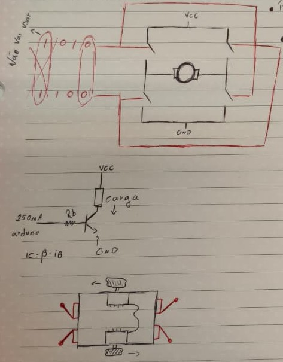
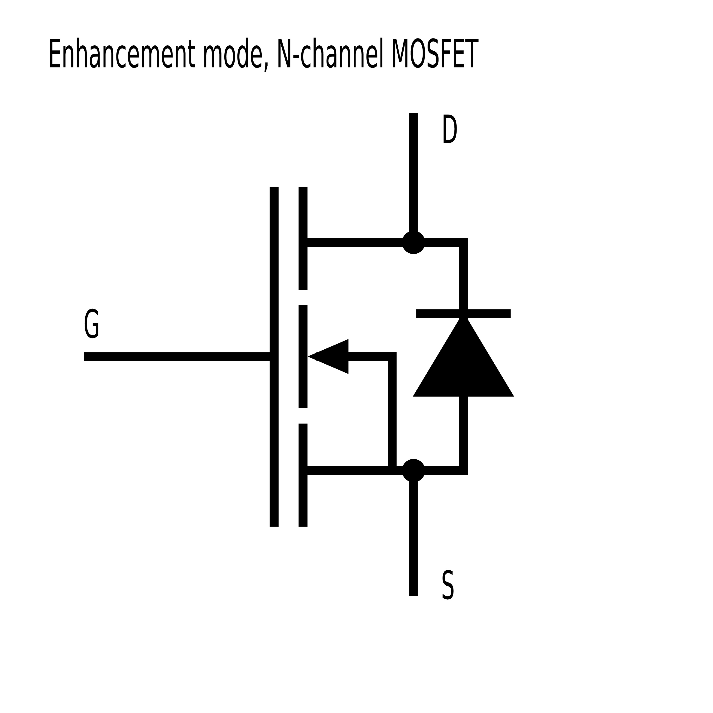
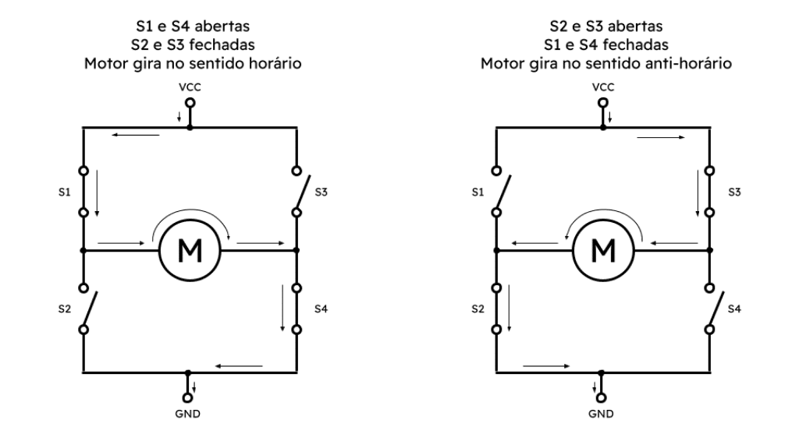

# Trabalho: Robô desvia-objetos — Nível 01

**Faculdade:** PUC-Goiás, Brasil  
**Curso:** Engenharia de Computação (Bacharelado)  
**Disciplina:** Microcontroladores e Microprocessadores  
**Aluno:** Eugênio José Moura Neto  
**Data:** 12/05/2025

---

## Sumário
1. [Objetivos](#objetivos)  
2. [Requisitos](#requisitos)  
3. [Materiais e componentes](#materiais-e-componentes)  
4. [Arquitetura do sistema](#arquitetura-do-sistema)  
5. [Topicos a serem estudados antes do projeto](#topicos-de-estudo)  
6. [Conteudo teorico](#conteudo-teorico)  

---

# Objetivos
- Construir e demonstrar um robô que desvia de obstáculos usando 04x micro-switches e 2 motores DC controlados por ponte H.
- Programar o ATmega328P manipulando registradores de forma direta.

# Requisitos
## Funcionais
- Detectar colisões e responder com movimentos adequados a colisão.
## Não-funcionais
- Sem uso de funções de alto nível (`delay`, `pinMode`).

# Materiais e componentes
- 01x Arduino UNO 
- 02x Motores DC
- 04x Micro-switch
- Ponte H, transistores, relé, LEDs, fonte.

# Arquitetura do sistema 
<!--  -->

# Topicos de estudo
1. Fundamentos elétricos
    - Lei de Ohm, potência, queda de tensão (V = R·I, P = V·I).
    - Fontes DC (baterias vs fonte de bancada).
    - Noções de ruído, capacitores de desacoplamento (by-pass) e condensadores de reserva.
2. Motores DC — comportamento em corrente máxima
    - Curva torque × corrente, corrente de partida (stall current) e corrente contínua máxima admissível.
    - Aquecimento do motor em operação na corrente máxima e impacto na vida útil.
3. Eletrônica de potência e H-bridge 
    - Escolha de dispositivos: MOSFETs logic-level (N-MOS)
    - Projeto de ponte H: princípio de funcionamento (2 canais por motor para frente/reverso).
4. Fonte, alimentação e proteções
    - Seleção de bateria/fonte que suporte correntes de pico e média; queda de tensão em cabos.
    - Fusíveis (rápidos vs retardados), proteção térmica e monitoramento.
    - Layout de GND e importância do GND comum entre Arduino e drivers.
    - Condensadores de desacoplamento próximos ao driver/motores e supressão EMI.
5. ATmega328P — GPIO e registradores
    - Mapas de pinos: PORTB, PORTC, PORTD; 
    - como usar DDRx, PORTx, PINx.
    - Entradas digitais com pull-up internos; leitura com mascaramento de bits.
    - Controle de enable/direction da H-bridge via pinos digitais (ex.: PORTD, PORTB).
    - Ferramentas: avr-gcc / PlatformIO / AVRDUDE; compilação bare-metal.
6. Timers e delays (sem `delay()`)
    - Timers (Timer0/Timer1/Timer2): modos Normal, CTC, Fast PWM, Phase Correct.
    - Cálculo de prescaler, OCRn, overflow e geração de timeouts/delays.
    - Implementar `delay_ms()` e timeouts de manobra sem bloqueios longos.
7. Interrupções, debounce e lógica de manobra
    - Interrupções externas INT0/INT1 e Pin-Change Interrupts (PCICR, PCMSKx).
    - Configurar bordas de detecção (subida/descida) e habilitar globalmente (`sei()`).
    - Debounce: técnicas de hardware (RC) e software (tempo mínimo entre eventos).
    - Algoritmo de reação sugerido: sensor frontal → parar → ré X ms → girar para lado oposto Y ms.
9. Integração, testes de robustez e documentação
    - Plano de testes: unitário (sensor, motor), integração (comportamento robô), regressão.
    - Execução de N repetições por cenário (ex.: 10 repetições: frente, traseira, múltiplos sensores).
    - Testes de falha controlados: desconexão de bateria, bateria fraca, curto simulado (com segurança).
11. Cálculos e verificações essenciais
    - Corrente de stall \(I_{stall}\) e corrente média \(I_{médio}\) — medir para dimensionar componentes.
    - Potência dissipada em MOSFET: \(P = I^2 \cdot R_{ds(on)}\) — calcular e dimensionar dissipador.
    - Capacidade mínima da bateria: estimar a autonomia (Ah) com base em I_médio e tempo desejado.
    - Cálculo de resistor de gate/base e seleção de fusível adequado.
12. Segurança e boas-práticas
    - Usar fusível na alimentação positiva e monitoramento térmico do driver.
    - GND comum corretamente estabelecido; evitar loops de terra.
    - Medir correntes com equipamento apropriado; proteções pessoais (óculos, ambiente seguro).
    - Não deixar circuitos sem supervisão durante testes de correntes altas.

# Conteudo teorico
## 1. Fundamentos elétricos
### 1.1. Lei de Ohm
> Princípio físico da eletricidade que descreve a relação entre as grandezas elétricas de tensão, corrente e resistência.  
> De forma simplificada, a 1° Lei de Ohm,  estabelece que  a corrente elétrica que flui através de um condutor é diretamente proporcional à tensão aplicada sobre ele e inversamente proporcional à resistencia do mesmo.

**$V = IR$**
- V - Tensão em Volts (V)
- I - Corrente em Ampères (A)
- R - Resistência em Ohms (Ω)

> A formula pode ser reescrita também nas formas d:

**$I = \frac{V}{R}$ ou $R = \frac{V}{I}$**  

**As grandezas:**
- **Tensão (V):** a tensão ou d.d.p. (diferença de potencial), é a força que impulsina as cargas elétricas (geralmente eletrons em condutores metalicos) a se moverem em um circuito. Sua unidade de medida é o **volt (V)**. Pense na tensão como a pressão que faz o movimento das cargas acontecer.
- **Corrente (I):** a corrente elétrica é o fluxo ordenado de cargas em um meio. Onde sua unidade de medida é o **ampère (A)**. Pense que a corrente é a quantificação da quantidade de corrente que passa no meio em um intervalo de tempo.
- **Resistência (R):** a resistência elétrica é a oposição natural que um material oferece a passagem de corrente elétrica. Onde a sua unidade de medida é o **ohm (Ω)**. Pense que a resistencia é a dificuldade na passagem de corrente que um material oferece naturalmente.

### 1.2. Potência
> Potência elétrica é a velocidade em que a energia elétrica é convertida em outra forma de energia. Pense nela como a quantificação da quantidade de quanta corrente é convertida em outro forma de energia, como calor ou luminosa. A sua unidade de medida é o **Watts (W)** 

**$$P = VI$$**
- P - Potência em Watts (W)
- V - Tensão em Volts (V)
- I - Corrente em Ampère (A)

Pode ser utilizado a 1° Lei de Ohm ( $V=RI$ ) para alterar a formula da potência dependendo da sua necessidade ou informações:
- Quando você não tem o conhecimento da tensão (V):
    - $P = I^2R$, esta fórmula é apropriada para calcular o calor que é gerado por uma corrente que passa por uma resistência.
- Quando você não tem conhecimento da corrente (I):
    - $P = \frac{V^2}{R}$, esta fórmula é útil para calcular a potência quando você  conhece a tensão aplicada e a resistência do componente.

**Diferença entre Potência e energia de consumo**
- **Potência (W ou kW):** é uma medida instantânea do consumo de energia por segundo do componente ou dispositivo.
- **Energia (kWh):** é a potência acumulada ao longo do tempo.
    - $Energia(kWh) = Potência(kW) * Tempo(horas)$

### 1.3.  Queda de tensão
> A queda de tensão é a perda da pressão que a tensão provoca da energia elétricca à medida que ela viaga ao longo de um condutor. Onde a queda de tensão ocorre porque todo material condutor, possuem uma resistência elétrica, ainda que pequena, sem falar de componentes elétricos ou eletrônicos que possuem uma resistência elétrica considerada e provocam uma perda na tensão.

- Um exemplo pratico da resistencia dos fios: $Vqueda = I * Rfio$.
- Outro exemplo é em resistor que reduz a corrente eletrica em calor ou luz, onde consecutivamente reduz a tensão.

### 1.4. Fontes DC (baterias vs fonte de bancada)
### 1.4.1. O que é uma fontes DC
**DC:** é uma simbologia e abreviação à Direct Current ou Corrente Contínua, que é um tipo de energia elétrica onde a sua tensão é constante e o fluxo de cargas se move somente em uma única direção.  
**Baterias:** é um dispositivo autômato que converte energia química armazenada em energia elétrica.  
**Fonte de bancada:** é um equipamento eletrônico que converte energia alternada (AC) da tomada em energia contínua (DC) estável e controlada.

### 1.4.2. Quando usar baterias ou fonte de bancada?
- **Baterias:** quando o seu projeto precisa ser móvel ou autônomo.
- **Fonte de bancada:** quando você está desenvolvendo, testando, prototipando ou conservando um circuito na sua mesa de trabalho.

### 1.5. Noções de ruído elétrico
O **ruído elétrico** é qualquer comportamento indesejado de um sinal elétrico. Considere que o ruído é como uma "sujeira" que polui a tensão ou corrente que deveria ser limpa e estável.  
Acresque que, essas flutuações podem ser interpretadas erroneamente por um microcontrolador, corrompendo dados, causando resets inesperados ou alterando leituras de  sensores analógicos.

### 1.6. Capacitores de desacoplamento (By-pass)
A função principal dos **capacitores de desacoplamento** é o fornecimento de energia instantânea e loval para um circuito integrado (CI), ao mesmo tempo que desvia o ruído elétrico de alta frequência para longe dele. Pense no by-pass como um amortecedor para a sua linha de alimentação elétrica.
- **Atuando como um reservatório local (Desacoplamento):** quando o chip precissa de um pulso de energia extremamente rápido para realizar uma operação, é muito mais eficiente obtê-lo de uma fonte que está a milimetros de distâncias do que puxa essa energia através de toda a trilha da placa de circuito a partir da fonte principal. O capacitor de desacoplamento age como essa mini-baterial local. Ele se descarrega instantaneamente para fornecer o pico de corrente, evitando tensão de alimentação do chip caia.
- **Atuando como um desvio para ruído (by-pass):** para sinais de alta frequência, um capacitor se comporta como um caminho de baixa resistência (baixa impedância); Quando o ruído de alta frequência viaja pela linha de alimentação, em vez de entrar no chip e causar problemas, ele "vê" um capacitor como um atalho fácil e direto para o terra (GND). Essencialmente, o ruído é desviado ao redor do chip.

### 1.7. Condensadores de reserva (ou Bulk Capacitors)
A sua função principal é atuar como um grande reservatório de energia local para todo o circuito, suavizando flutuações de baixa frequência e fornecendo grandes picos de corrente quando necessário. Analogia de atuação entre capacitores de acoplamento e condensadores de reserva:
- Capacitores de desacoplamento: são como caixas de água indivuduais de cada casa. Ou seja, este  fornece energia para um componente específico.
- Capacitor reserva: é uma grande torre de agua para o baixo todo. Ou seja, este fornce energia para o circuito todo.

Os condensadores de reserva geralmente são posicionados na entrada de energia do circuito, geralmente logo após o regulador de tensão ou onde o conector de alimentação se conecta à placa. Eles resolvem dois problemas:
- Suprir picos de corrente (demandas pesadas);
- Filtrar ondulações de baixa frequência (ripple);

## 2. Motores DC — comportamento em corrente máxima
### 2.1. Princípio básico de um motor
Um motor DC converte energia elétrica em energia mecânica, em forma de rotação. Ele faz isso usando um princípio simples: quando uma corrente elétrica passa por uma bobina dentro de um campo magnético, uma força é gerada, fazendo o eixo do motor girar. Acresce que, um motor DC simples tem o sentido de rotação determinado pela direção do fluxo de corrente entre seus terminais.
- **Velocidade (RPM):** RPM vem de rotação por minuto, então a velocidade nada mas é que quantas vezes o eixo dá uma volta completa, o que define a velocidade do motor. Este é controlada diretamente pela tensão (V), ou seja, quanto maior a tensão fornecida ao motor, maior será sua velocidade.
- **Torque:** é a força de rotação, ou em outras palavras, a capacidade do motor de fazer força. Você pode pensar no torque como a força que o motor aplica para girar uma carga.
- **Corrente (A):**  é a quantidade de energia elétrica que o motor está consumindo.

### 2.2. Relação fundamental: torque é proporcional à corrente
> O torque que um motor DC produz é diretamente proporcional à corrente elétrica que ele consome, ou seja:
> - se o motor precisa fazer pouca força, ele girar livremente, ele vai ter que consumir pouca corrente, já que o torque dele está baixo.
> - se o motor precisa fazer muita força, como subindo uma rampa ou levantando um peso, ele vai consumir muita corrente.

Acreve que, esta relação é praticamente linear, o que nos leva à curva torque x corrente.

### 2.3. Os dois extremos de operação (que definem a curva)
### 2.3.1. Cenário 1: Rotação Livre (No-Load)
O motor está ligado, mas não há nada conectado ao seu eixo. Ele gira o mais rápido e livremente possivel.  
Onde a sua velocidade estará no máximo, o torque estará no mínimo, a corrente será mínima.

### 2.3.2. Cenário 2: Motor travado (Stall) - A corrente máxima
A energia está aplicada ao motor, mas seu eixo está completamente travado e impedido de girar.  
Onde a sua velocidade é zero, o torque do motor estará no máximo, a corrente estará no máximo.

### 2.4. A curva torque x corrente
O gráfico que relaciona essas duas grandezas é uma linha reta. Onde os seus eixos são:
- Eixo Y - torque
- Eixo X - corrente

1. O gráfico começa no Ponto de Rotação livre, onde a corrente é muito baixa e torque muito baixo.
2. À medida que você aplica uma carga no eixo do motor, ele precisa de mais torque para continuar girando. Para gerar esse torque, ele automaticamente puxa mais corrente da fonte.
3. A linha sobe de forma reta até atingir o Ponto de Stall, onde o motor está aplicando o seu torque máximo e, para isso, consome sua corrente máxima.

### 2.5. Corrente de Partida (Stall Current) - O ponto crítico da curva torque x corrente
A **corrente de partida ($Istall$)** é a corrente máxima que um motor DC consome quando a tensão nominal (voltagem específica em que um equipamento elétrico ou cabo é projetado para operar de forma segura e eficiente)  é aplicada, mas seu eixo está completamente travado e impedido de girar.  
Ou seja, é o ponto mais extremo da curva de torque x corrente, onde o torque é máximo e a velocidade é zero.

### 2.6. Corrente contínua máxima admissível
A **corrente contínua máxima admissível** é a mior corrente que um motor DC pode consumir indefinidamente sem superaquecer e sofrer danos permanentes, enquanto ainda está produzindo torque. Onde é a corrente correspondente ao torque contínuo máximo admissível.  
A diferença entre a corrente de partida e corrente contínua máxima admissível:
- Corrente de partida: é o pico máximo de corrente e torque (velocidade zero), onde tem duração apenas por  alguns segundos ou milissegundos é tolerável sem danificar o motor.
- Corrente contínua máxima admissível: é um ponto abaixo do Stall, onde o motor ainda está girando, mas sob uma carga pesada, onde pode ser mantido indefinidamente sem danificar o motor.

### 2.7. Aquecimento do motor em operação na corrente máxima e impacto na vida útil
Quando um motor DC está operante ele converte parte da energia elétrica recebida em energia mecânica e uma parte considerável em calor. Onde esté calor é um subproduto inevitável da sua operação.  
### 2.7.1. Principais fontes de aquecimento na operação de motores DC 
- **Efeito Joule:** a mais significante delas, onde a corrente elétrica ($I$) que flui pelas bobinas do motor é dissipada parte dela em forma de calor pela potência elétrica do motor ($Pcalor = I^2 * Rmotor$). Onde, quanto maior a corrente que passa pelo motor, maior será o calor gerado, e de forma exponencial (dobro da corrente =  quadriplo de calor).
- **Perdas por fricção:** atrito nos rolamentos ou buchas e nas escovas geram calor.
- **Perdas no núcleo (Ferro):** em motores com núcleo de ferro, há perdas por histerese e correntes parasitas que também geram calor.

### 2.7.2. Corrente máxima e aquecimento
Quando o motor opera na corrente máxima:
- **Corrente de partida (Stall Current):** gera a quantidade máxima e mais  rápida de calor. Como a corrente é altíssima e o motor não está girando, o que provoca na ausencia de ventilação interna, o calor se acumula muito rápido.
- **Corrente contínua máxima admissível:** representa o ponto em que o calor gerado ($I^2 * R$) é igual ou ligeiramente menor do que a capacidade do motor de dissipar esse calor para o ambiente. Onde o motor atinge uma uma temperatura de equilíbrio, entretanto está temperatura está próxima do limite seguro dos seus materiais.

### 2.7.3. Impacto do aquecimento na vida útil do motor
O calor é um dos principais fatores de redução do tempo de vida útil dos motores elétricos, onde a temperatura elevada acelera a degradação dos mateiriais críticos do motor.

## 3. Eletrônica de potência e H-bridge robusta

### 3.1. Transistor
Um **transistor** é um dispositivo semicondutor que pode atuar como um interruptor eletrônico (liga/desliga) ou como um amplificador de sinal.

### 3.1.1. Os dois modos de operação de um transistor:
> - **Transistor como um interruptor eletrônico:** Um pequeno sinal no terminal de controle faz com que o trnaisstor "abra" completamente, permitindo que uma corrente muito maior passe por ele. Quando o sinal de controle é removido, o transistor abre o circuito e com isso impede a passagem de corrente elétrica. Pense que ele funciona abrindo ou feichando um tubo que permite a passagem de energia, com base em um estimulo energetico no seu terminal de controle.
> - **Transistor como um amplificador de sinal:** Um pequeno sinal elétrico é aplicado ao terminal de controle. O transistor então cria uma cópia muito maior desse sinal no seu terminal de saída. Pense da seguinte forma, um sensor manda vários sinais elétricos com baixa tensão, quando o sinal chega no seu terminal de controle, ele abre fecha o circuito e o terminal de entrada com muita energia passa para o terminal de saída, quando o sinal acaba o pino de controle faz com que o circuito se abra, interrompendo a corrente.

### 3.2. MOSFETs logic-level (N-MOS)
Um **MOSFET (Transistor de Efeito de Campo de Semicondutor de Óxido de Metal)** é um tipo de transistor que funciona como um interruptor controlado por tensão. Tendo 3 terminais:

> - **Gate (G):** é o pino de controle.
> - **Drain (D):** é o pino de dreno, entrada de corrente
> - **Source (S):** é o pino de fonte, saída de corrente

 

<!--  -->

### 3.2.1. Funcionamento MOSFET
1. Um MOSFET de Canal N está "ligado" (permite a passagem de corrente entre Drain e Source) quando você aplica uma tensão positiva no Gate em relação ao Source.
2. Como o Source é quase sempre conectado ao terra (GND), basta aplicar uma tensão positiva no Gate para ligar o interruptor.

### 3.2.2. Tipos de MOSFET e qual o melhor para usar com um microcontrolador
> - **MOSFET padrão:** a maioria dos MOSFET de potência  precisa de uma tensão relativamente alta estimulando o Gate para o MOSFET ser saturado (permitir a passagem de corrente do Drain para o Source), geralmente em torno de $10-12 V(Volts)$. Acresce que, um pino do Arduino UNO (microcontrolador escolhido no projeto) pode fornecer só $5 V$, o que não seria suficiente para saturar o MOSFET padrão de forma eficiente, o que provocaria um aquecimento alto nele.
> - **MOSFET Logic-Level:** são projetados especificamente para serem saturados com as tensões baixas dos sinais lógicos de um microcontrolador (tipicamente entre $3.3-5 V$)

 

> A melhor escolha de MOSFET para um microcontrolador é um MOSFET Logic-Level.

### 3.3. Como inverter a rotação de um motor DC?
Um motor DC simples gira em uma direção quando a corrente flui de um terminal para o outro. Para que ele gire na direção oposta, a corrente precisa fluir na direção contraria. A melhor forma de se fazer isso é utilizando uma ponte H.

### 3.3.1. Ponte H
A ***ponte H** é um circuito eletrônico que permite que uma fonte de alimentação DC seja aplicada aos terminais do motor em duas polaridades diferentes, invertendo assim a direção da corrente e, consecutivamente, a direção de rotação do eixo do motor.

### 3.3.1.1. Componentes da Ponte H
A Ponte H é contruída com 4 interruptores controlados eletronicamente:
- **Q1, Q2, Q3, Q4:** os transistores.
- **M:** o motor DC.
- **VCC:** a fonte de alimentação.
- **GND:** o terra.

> **Acresce que, a chave da Ponte H é que apenas dois interruptores opostos diagonalmente podem ser ativados ao mesmo tempo para permtir o fluxo de corrente em uma direção. A ativação de outros  causaria curto-circuito.**

 

<!--  -->

### 3.3.1.2. Rotação para a frente (Forward)
Para o motor girar para a frente, queremos  que a corrente flua de, por exemplo, esqueda para a direita através do motor.
- **Interruptores ativados:**
    - **Q1:** liga, conectando o terminal esquerdo do motor ao GND.
    - **Q4:** loga, conectando o terminal direito do motor ao VCC.

### 3.3.1.3. Rotação reversa (Reverse)
Para o motor  girar para trás, queremos que a corrente flua da direita para a esquerda através do motor.
- **Interruptores ativados:**
    - **Q2:** liga, conectando o terminal direito do motor ao GND.
    - **Q3:** loga, conectando o terminal esquerdo do motor ao VCC.

### 3.3.2. Controle com Microcontrolador
Um microcontrolador controlara a Ponte H conectando seus pinos digitais aos Gates dos MOSFETs. Para controlar um motor, você precisa de dois pinos de controle ou dois canais:
- Pino 1: controla Q1 e Q4 (para frente).
- Pino 2: controla Q2 e Q3 (para trás).